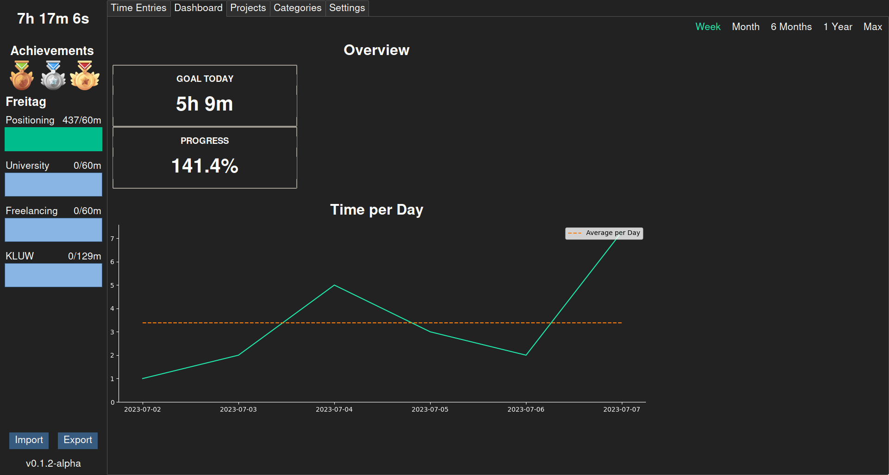
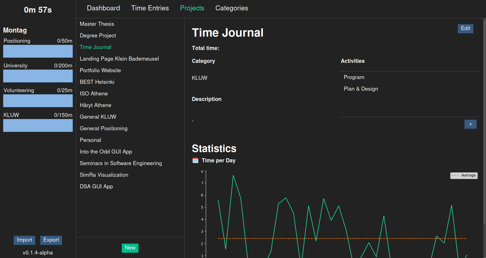
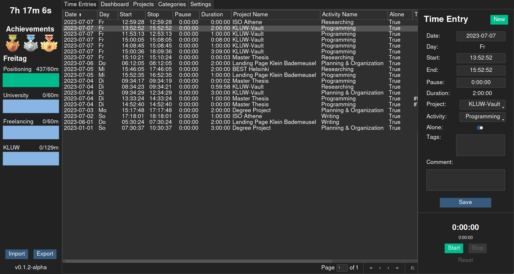

# Time Journal

A time journal application to set goals and track time during the day.

> The project is in a very early stage and requires knowledge of relational databases and Python to be useful (see the section below).

The application allows you to set daily goals for project categories, as well as to follow your progress over time. Achievement medals are rewarded when more than 2, 4, or six hours have been spend on project specific tasks.

Time is tracked according to project specific activities.

Time entries can be sorted and filtered. New time entries can be created manually or automatically with a built-in timer.

## Setup and Database Preparation

Download the latest release. Currently I only provide the package for Linux distribution. If you want to run the program on MacOS or Windows, please follow the instructions in [CONTRIBUTING.md](CONTRIBUTING.md) to build a package for your distribution with PyInstaller.

Once the download is finished, unzip it, navitage into the new directory, and execute the `TimeJournal` file within. When the program is started for the first time, a new SQLite database is created in the root directory, called `time-journal.db`. Before entries can be made, projects, project categories, project category goals, and project activities have to be created manually inside the database. For doing so I recommend the free software [DBeaver](https://dbeaver.io).

> Before making changes to the database, always backup your data!

To do so, it is sufficient to copy the `time-journal.db` file and place the copy in another directory. Alternatively, the export button inside the application can be used.

After opening the database file, navigate to the tables and create at least one entry in each of the following tables:

1. **project_categories**: Provide at least an `id` and a `name` for each category.
2. **projects**: Provide at least an `id` and a `name` for each project.
3. **activities**: Each project has its own set of activities. That means if you want to be able to track the activity "Programming" in two projects, you have to create two entries in this table; one for project A, and another one for project B.

## Usage

Once the database setup is finished, start the program again by executing the `TimeJournal` file in the root directory. You can test, whether your setup was successful, by clicking "New" in the top right corner. Now you should be able to select the projects you just created in the combobox of the form. Also verify that all the activities which you created for each project are listed in the activities combobox.

The application is in a very early stage and not all functionality has been implemented. If a value is not shown correctly, try restarting the application; not all widgets update automatically.
