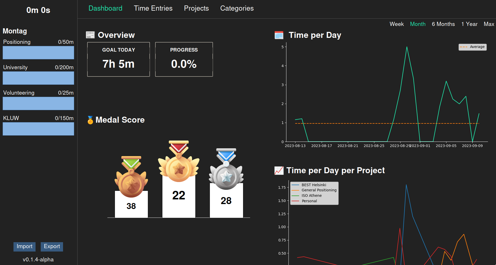

# Time Journal

A time journal application to set goals and track time during the day. The application allows you to set daily goals for project categories, as well as to follow your progress over time. Achievement medals are rewarded when more than 2, 4, or six hours have been spend on project specific tasks.

A dashboard provides an overview about tracked work sessions, the accumulated time per project per day, and more.

Time is tracked according to project specific activities.

Time entries can be sorted and filtered, as well as edited via the time entries list.

New time entries can be created manually or automatically with a built-in timer.

## Setup

Download the latest release. Currently I only provide the package for Linux distribution. If you want to run the program on MacOS or Windows, please follow the instructions in [CONTRIBUTING.md](CONTRIBUTING.md) to build a package for your distribution with PyInstaller.

Once the download is finished, unzip it, navitage into the new directory, and execute the `TimeJournal` file within. When the program is started for the first time, a new SQLite database is created in the root directory, called `time-journal.db`. Before entries can be made, projects, project categories, project category goals, and project activities have to be created. To do so, go to the "Projects" and "Categories" tab in the application. For created projects and project activities to show up as items in the drop down lists for new time entries, a restart is currently required.

## Disclaimer

The application is in a very early stage and not all functionality has been implemented. If a value is not shown correctly, try restarting the application; not all widgets update automatically.
